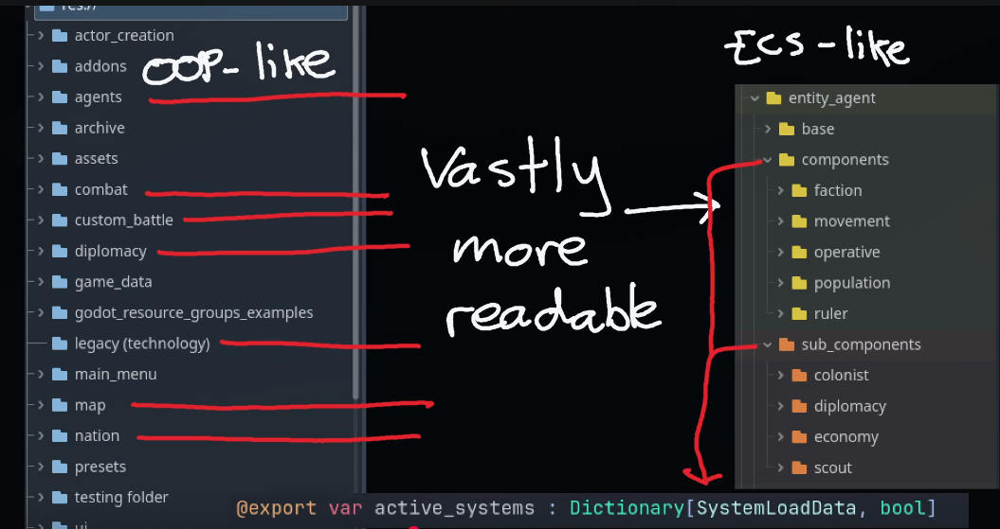

# todo

## next

- update gotdotenv to 2.16 in shell, just copy from godotenv repo
- setup godotenv for addons
- add godot exports to the shell
- default dvc server config, add to readme to revise

- test matugen module with new ssh keys
- move dev to cedar
- 

- first addon: simple 3d character
- first addon: simple 3d level for prototyping

## backlog

- github actions
  - commitlint
  - semantic-release
  - code coverage
  - unit tests
  - self hosted runner:
    - cross platform build
    - release  
- dvc remove gum from precommit hook and shell
- how to package dvc assets for addons?
  you can package in place with something like:

  ```bash
  dvc pull
  rsync -av \
    --exclude '.git*' \
    --exclude '.dvc*' \
    ./ ./_dist/
  ```

  just need to add rsync as dep and some sort of justfile/make to tarball it

- better asset detection in scripts for the pre-commit hook, use an actual git ignore file + any other file extension or mimetype. maybe mimetypes are better?
  - [for images as an example](https://github.com/github/gitignore/blob/main/Global/Images.gitignore)

[components](./docs/components/components.md)

- healthcomponent - health and damage system
- velocitycomponent - movement calculations
- movementcomponent - apply movement to entities
- audiocomponent - sound effects
- timercomponent - time-based mechanics
- hurtboxcomponent - damage detection
- hitboxcomponent - damage dealing
- weaponcomponent - combat mechanics
- interactablecomponent - world interaction
- followcomponent - basic ai
- jumpcomponent - platformer mechanics
- dashcomponent - advanced movement
- pathfindcomponent - ai navigation
- detectioncomponent - ai awareness
- healthbarcomponent - visual feedback

- docs to prune
  - components/examples/
  - components/advanced/
  - components/component-patterns.md - somewhat ok
  - components/getting-started.md - redundant
  - design.md - self written, misc notes

### lower priority

- better vscode extension recommendations

## unsure

- automate dvc merge conflict asset comparison (checkout and cp)

- list of recommended addons i should have by default
  - something

initial addons?:

ai integration:

- godot-mcp?

## build & deployment

- **build automation:**
  - scripted exports for windows, linux, web
  - custom export pipeline for faster iterations
- **deployment tools:**
  - itch.io upload script (butler?)
  - steam upload script (butler?)
- **web optimization:**
  - default web export settings for performance/size

## game jam specific features

- **scene management:**
  - simple scene loader/manager
- **ui systems:**
  - basic main menu, pause menu, game over screens
  - settings menu (volume, controls)
- **input management:**
  - rebindable controls via input map system
- **data persistence:**
  - simple save/load system
- **feedback & debugging:**
  - screenshot/gif recorder
  - simple in-game debug console

## nix - further enhancements

- **gpu acceleration:**
  - verify and document gpu acceleration setup for godot editor under nix
- **declarative godot editors:**
  - explore options for declarative installation of specific godot editor versions
- **additional libraries/tools:**
  - integrate more nix packages useful for game development (e.g., image manipulation tools, audio tools)
- **documentation:**
  - comprehensive nix setup guide for godot
  - explain how to manage different godot versions with nix

### design docs todo

#### misc notes / unorganized

- anti piracy:
  - login with steam? [godot has better auth with third party steam support](https://gist.github.com/Whats-A-MattR/5bce5574e568e8d8e6be55cf692df3a1) [godot betterauth plugin](https://godotengine.org/asset-library/asset/4416)
  - requires putting assets or systems on a server

- addons
  - ai:
    - [LimboAI](https://godotengine.org/asset-library/asset/3787) - ai framework
  - debugging:
    - [LimboConsole](https://godotengine.org/asset-library/asset/3338) - in-game dev console with useful features
  - auth
    - [BetterAuth](https://godotengine.org/asset-library/asset/4416) - steam auth
  - performance:
    - [gecs - godot entitiy component system](https://github.com/csprance/gecs/tree/main) - entity component system

- video notes
  - [composition](https://youtu.be/rCu8vQrdDDI)
    - make components for each game where generics are useful
    - examples:
      - velocity componenet
      - knockback component
      - aim component
      - health component
      - damage component
      - pathfinding component
  - [ecs with godot](https://youtu.be/pkTwRdESsBA?list=TLPQMjAxMDIwMjX2Hm-IkDDUZQ)
    - 